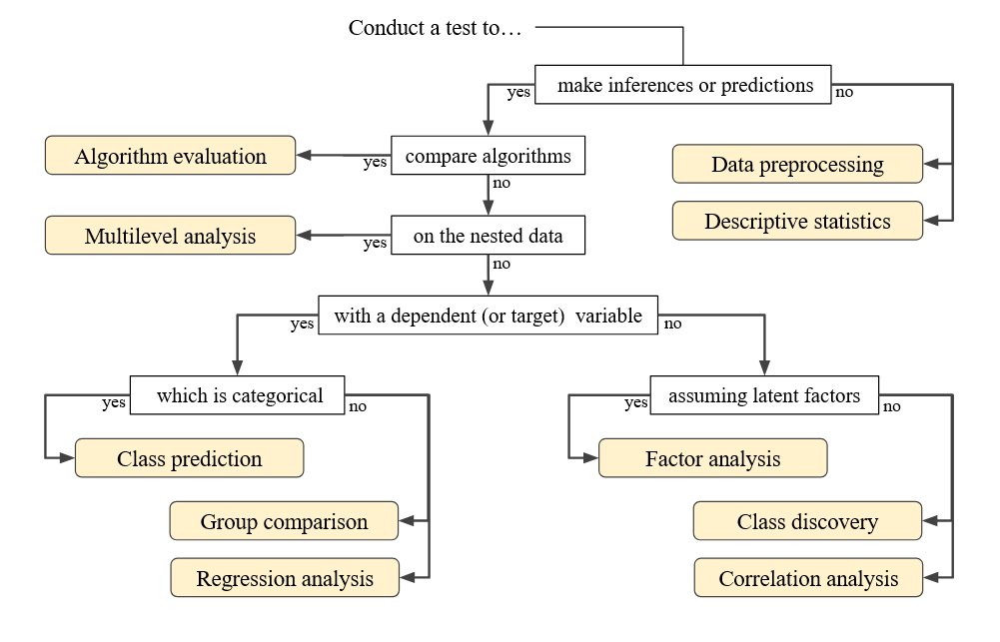

```{r, include = FALSE}
knitr::opts_chunk$set(
  collapse = TRUE,
  comment = "#>"
)
```

```{r echo = FALSE, results = 'asis'}
datatype <- c(
  "Data Analysis",
  "Data Preprocessing",
  "Descriptive Statistics",
  "Algorithm Evaluation",
  "Multilevel Analysis"
)
url <- c(
  "https://doi.org/21.T11969/feeb33ad3e4440682a4d",
  "https://doi.org/21.T11969/37182ecfb4474942e255",
  "https://doi.org/21.T11969/5b66cb584b974b186f37",
  "https://doi.org/21.T11969/5e782e67e70d0b2a022a",
  "https://doi.org/21.T11969/c6b413ba96ba477b5dca"
)
examples <- c(
  "Composition of methods",
  "Filtering, missing data imputation",
  "Mean, median, standard deviation",
  "Benchmark-based model evaluation (Task, Dataset, Metric, Score)",
  "Hierarchical linear model / linear mixed model, multilevel structural equation model, multilevel latent class analysis")
schemata_table <- data.frame(DataType = datatype,
                             URL = url,
                             Examples = examples)
knitr::kable(schemata_table, caption = "Data Types for Various Methods")
```

```{r out.width = '100%', echo = FALSE}

```
